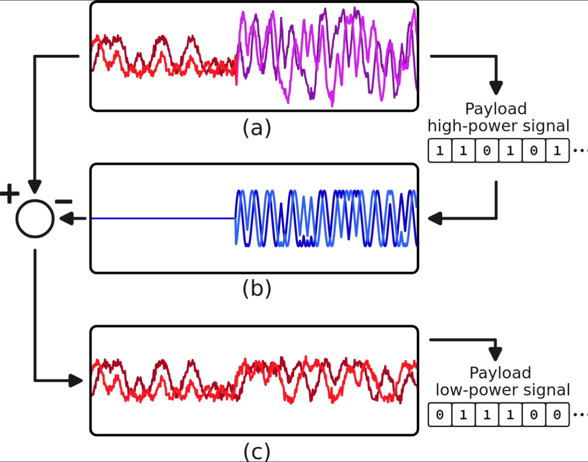

# gr-sic
Proof-of-concept implementation of Successive Interference Cancellation (SIC) that recovers colliding BLE and IEEE 802.15.4 packets through coarse-to-fine frequency search and cross-correlation. 

The system, implemented in GNU Radio, first demodulates the stronger signal, then reconstructs and subtracts its waveform to recover the weaker transmission, enabling concurrent demodulation despite time/frequency overlaps. The experimental setup uses two transmitters and one receiver connected to a single host computer.

<figure>
  
  <figcaption>
    <em>Dual PlutoSDR setup. One Pluto is used as transmitter and receiver, while the second one is used only as a transmitter.</em>
  </figcaption>
</figure>


## Algorithm Overview
Assuming the received signal can be modelled as the addition of both protocols and noise:  
  `s_rx[t] = A_h * s_tx,h[t - t_h] * exp(j(2πf_h t + ϕ_h)) + A_l * s_tx,l[t - t_l] * exp(j(2πf_l t + ϕ_l)) + n[t]`,  
 the procedure is as follows:

1. **High-power protocol demodulation first.** If the demodulated payload passes the CRC check, the I/Q samples corresponding to the packet plus an offset before and after are stored.
2. **High-power signal reconstruction.** Using the payload (and base address for BLE), the baseband I/Q high-power signal is reconstructed with protocol-specific pulse shaping.
3. **Parameter estimation** via cross-correlation over a coarse-to-fine range of frequency offsets (fₕ) between the reconstructed high-power signal and the received interfered signal:
   - Frequency offset (f_h)
   - Time delay (t_h)
   - Phase offset (φ_h)
   - Amplitude (A_h)
4. **Subtraction** and weak-signal protocol recovery from the residual.

<figure>
  
  <figcaption>
    <em>SIC algorithm overview: (a) Received collision, (b) High-power reconstruction, (c) Residual after subtraction.</em>
  </figcaption>
</figure>


## Example applications
Two example applications can be found in the `apps` folder:
- `sic_simulation_app.grc` uses an AWGN simulated channel to test, without additional hardware, the module blocks
- `sic_app.grc` provides a working example with two PlutoSDRs, one of them working as a transmitter and receiver, and the other only as a transmitter. A slowing factor parameter is added to avoid overruns in the program if the computer is unable to keep up with the high sample rate and simultaneous processing. When this parameter is 1, the sample rate is set to 4 MHz, BLE to 1 Mb/s, and IEEE 802.15.4 to 2 Mchip/s (260 kb/s) by default

## Build Instructions
```bash
mkdir build && cd build
cmake ..
make
sudo make install
sudo ldconfig
```
